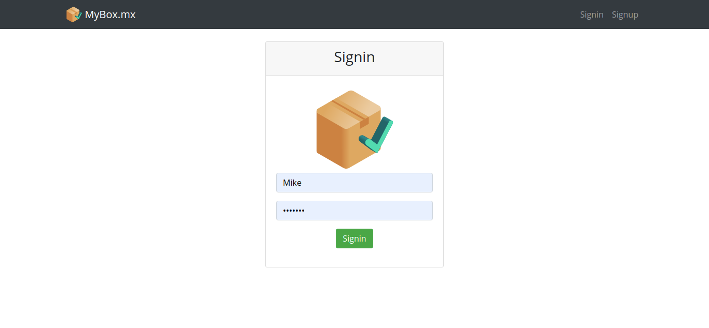

# MyBox 📦
Web app implementation using mySQL, Nodejs, Express, Handlebars among others. This project aims to use the stack of technologies that I have learned until this moment (Local Auth, Routing, Form management, Database Queries).

<h2 align="center">
  
   
</h2>

## Features 💡
⚡️ Styled with Bootstrap\
⚡️ Protection of routes\
⚡️ Analysis and implementation of DB requirements\
⚡️ Data encryption\
⚡️ Well organized backend

To view the current webpage, **[click here](https://my-box-mx.herokuapp.com/)**

## Technologies used 🛠️
- [Express](https://expressjs.com/) - Backend framework for web applications\
- [Handlebars](https://handlebarsjs.com/) - Frontend templating engine\
- [Bootstrap](https://getbootstrap.com/docs/4.6/getting-started/introduction/) - Front-end open source toolkit\
- [MySQL](https://www.mysql.com/) - Relational database management system\
- [Bcrypt.js](https://www.npmjs.com/package/bcrypt/) - Hashing library

## Scenario 📁
You want to digitize the management of the transport company MiCaja.MX that distributes packages throughout Mexico.
The people in charge of carrying the packages are the truckers, from whom they want to keep: the INE, name, telephone, address, salary and state in which they live.
Of the packages transported, it is interesting to know: the package code (unique), description, Recipient's name, recipient's address, sender's name and sender's address.
A trucker distributes many packages and a package can only be distributed by a trucker.
Of the states to which the packages arrive, it is interesting to keep the state code and
the name of the state.
A package can only reach one state. However, several packages can reach one State.
Of the trucks that truckers carry, it is interesting to know the license plate, model, type of truck and wheeled.
A trucker may drive different trucks on different dates, and one truck may be driven by multiple truckers.

## Entity Relationship Diagram 🧩

## Relational Diagram 🧩

## MySQL 📋
The Databases and tables scripts can be found at /databases/db.sql
